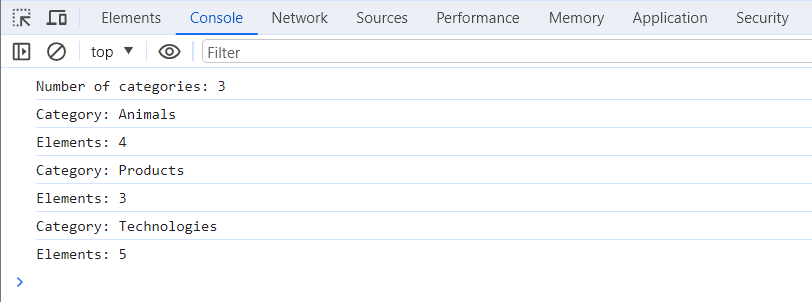

# GOIT-JS-HW-07 🚀

Congratulations — you're in the second half of the JavaScript course! 💪

While the first half covered the syntax of the language, you are now starting a new phase. It's time to summarize what you've accomplished in Module 7.

Test yourself — you should now be familiar with:

- What the Document Object Model (DOM) is and how the hierarchy of DOM elements is structured.
- The basic properties and attributes of DOM elements.
- How to create and delete elements within the DOM tree.
- The nature and functionality of browser events.
- How to handle events with methods like `addEventListener()` and `removeEventListener()`.
- How to implement events for form elements.

It's time to practice and solidify this knowledge!

## Assignment 7

- Create a repository named `goit-js-hw-07`.
- Read each task and implement it in your code editor.
- Tasks must be completed in strict accordance with the technical requirements (modifying the original HTML is prohibited).
- There should be no errors or warnings in the console when opening the live page for the task.
- Ensure your code is formatted with `Prettier`.
- Submit your assignment for review.

**Submission Format:** Your homework should include two links: one to the source files and one to the live page on `GitHub Pages`.

You can download the starter files from [this link](https://minhaskamal.github.io/DownGit/#/home?url=https://github.com/goitacademy/javascript-homework/tree/main/v3/07/src). Copy the ready-made layout and script files for each task into your project. Note that the starter files are in the `src` folder. However, when creating a live page on GitHub, it's important that the `index.html` file is in the root directory of your project, without any additional folders. Therefore, you should only move the contents of the `src` folder into your project, not the `src` folder itself.

#### :bangbang: Use this [Figma layout](https://www.figma.com/file/m8k9NQV7qZrtYDCvxfD68B/%D0%94%D0%97-JavaScript?type=design&node-id=0-1&mode=design&t=5dMtUnN59NyVpg7o-0) to style your tasks.

---

## 📝 Task 1

The HTML contains a list of categories, `ul#categories`.

```html
<ul id="categories">
  <li class="item">
    <h2>Animals</h2>
    <ul>
      <li>Cat</li>
      <li>Hamster</li>
      <li>Horse</li>
      <li>Parrot</li>
    </ul>
  </li>
  <li class="item">
    <h2>Products</h2>
    <ul>
      <li>Bread</li>
      <li>Parsley</li>
      <li>Cheese</li>
    </ul>
  </li>
  <li class="item">
    <h2>Technologies</h2>
    <ul>
      <li>HTML</li>
      <li>CSS</li>
      <li>JavaScript</li>
      <li>React</li>
      <li>Node.js</li>
    </ul>
  </li>
</ul>
```

Write a script that, using DOM properties and methods, performs the following functions:

1.  Calculates and prints to the console the number of categories in `ul#categories`, i.e., the number of `li.item` elements.
2.  For each `li.item` element in the `ul#categories` list, it finds and prints to the console the text of the element's title (the `<h2>` tag) and the number of elements in that category (all the nested `<li>` elements).

### Mentor's Checklist:

- The number of categories, their names, and the count of their contents are retrieved using DOM element properties and methods.
- Data for each category is retrieved and printed to the console within a loop or using the `forEach()` method.
- The console should display the following content:



---

## 🖼️ Task 2

Write a script to create an image gallery based on an array of data. The HTML contains a list, `ul.gallery`.

```html
<ul class="gallery"></ul>
```

Use the `images` array to create `` elements nested within `<li>`. You can create and add HTML elements using `document.createElement()` and `elem.append()` or template strings and `elem.insertAdjacentHTML()`.

- All gallery items should be added to the DOM in a single insertion operation.
- Add minimal styling for the gallery using CSS classes and flexbox.

```js
const images = [
  {
    url: "[https://images.pexels.com/photos/140134/pexels-photo-140134.jpeg?dpr=2&h=750&w=1260](https://images.pexels.com/photos/140134/pexels-photo-140134.jpeg?dpr=2&h=750&w=1260)",
    alt: "White and Black Long Fur Cat",
  },
  {
    url: "[https://images.pexels.com/photos/213399/pexels-photo-213399.jpeg?dpr=2&h=750&w=1260](https://images.pexels.com/photos/213399/pexels-photo-213399.jpeg?dpr=2&h=750&w=1260)",
    alt: "Orange and White Koi Fish Near Yellow Koi Fish",
  },
  {
    url: "[https://images.pexels.com/photos/219943/pexels-photo-219943.jpeg?dpr=2&h=750&w=1260](https://images.pexels.com/photos/219943/pexels-photo-219943.jpeg?dpr=2&h=750&w=1260)",
    alt: "Group of Horses Running",
  },
];
```

### Mentor's Checklist:

- A gallery with three images has been created and added to the DOM.
- The gallery is added to the `ul.gallery` list and consists of 3 `<li>` elements, each containing an `` element.
- Data from the `images` object array was used to create the `` elements.
- The gallery items are added to the DOM in a single insertion operation.
- Minimal styling has been applied to the gallery using CSS classes and flexbox.

---

## ⌨️ Task 3

Write a script that, when text is typed in the `input#name-input` (the `input` event), substitutes its current value into `span#name-output` as a welcome name. Be sure to trim any whitespace around the input value. If the input is empty or contains only spaces, the span should display the string `"Anonymous"` as the name.

```html
<input type="text" id="name-input" placeholder="Please enter your name" />
<h1>Hello, <span id="name-output">Anonymous</span>!</h1>
```

### Mentor's Checklist:

- The `input` event is being listened for on the `input#name-input` element.
- As text is typed in the input, its current value is placed into `span#name-output` as a greeting name.
- The value from the input has been trimmed of any leading or trailing whitespace.
- If the input is empty or contains only spaces, the text `"Anonymous"` is displayed in the span instead of a name.

---

## 🗳️ Task 4

Write a script to manage a login form.

```html
<form class="login-form">
  <label>
    Email
    <input type="email" name="email" />
  </label>
  <label>
    Password
    <input type="password" name="password" />
  </label>
  <button type="submit">Log in</button>
</form>
```

1.  Form submission for `form.login-form` should be handled via the `submit` event.
2.  The page should not reload when the form is submitted.
3.  If there are unfilled fields in the form upon submission, display an `alert` with the warning `'All form fields must be filled in'`. Do not add the `required` attribute to the inputs; validation should be done via JS.
4.  If the user fills in all fields and submits the form, collect the field values into an object with two properties, where the keys are the field names and the values are the corresponding values of those fields, trimmed of any surrounding whitespace. Use the `elements` property to access the form elements.
5.  When the form is submitted, an object with the entered data should be printed to the console, and the values of the form fields should be cleared using the `reset` method.

### Mentor's Checklist:

- The `submit` event is being listened for.
- The page does not reload upon form submission.
- An `alert` is displayed if there are unfilled fields in the form during submission.
- Upon submission, an object with key-value pairs is created, where keys are the field names and values are their corresponding trimmed values.
- After submission, the form elements are cleared.

---

## 🎨 Task 5

Write a script that changes the background color of the `<body>` element when `button.change-color` is clicked and assigns this color as text content to `span.color`.

```html
<div class="widget">
  <p>Background color: <span class="color">-</span></p>
  <button type="button" class="change-color">Change color</button>
</div>
```

Use the `getRandomHexColor()` function to generate a random color.

```js
function getRandomHexColor() {
  return `#${Math.floor(Math.random() * 16777215)
    .toString(16)
    .padStart(6, 0)}`;
}
```

Note that the `getRandomHexColor()` function returns a color in hex format, but the background color on the `<body>` will be in rgb format. This is normal and does not require any changes.

### Mentor's Checklist:

- The background of the `<body>` will only be set after clicking `button.change-color`.
- Each time `button.change-color` is clicked, the `<body>` background will be painted a new random color.
- The `<body>` and `span.color` will have the same color values.

---

## ✨ Task 6

Write a script for creating and clearing a collection of elements that has the following functionality.
There is an `input` where the user enters the desired number of elements. After clicking the `Create` button, a collection with the correct number of elements should be rendered (added to the DOM) and the value in the input should be cleared. If the `Create` button is clicked again, a new collection should be rendered on top of the existing one. After clicking the `Destroy` button, the collection of elements should be cleared.

```html
<div id="controls">
  <input type="number" min="1" max="100" step="1" />
  <button type="button" data-create>Create</button>
  <button type="button" data-destroy>Destroy</button>
</div>

<div id="boxes"></div>
```

After the user clicks the `Create` button, it's necessary to validate that the value in the `input` is between 1 and 100. Only if this condition is met should new `<div>` elements be added to the DOM.

To create the elements on the page, create a function named `createBoxes(amount)`. This function should take one parameter, which is the number of elements to create. The function should create as many `<div>` elements as specified in the `amount` parameter and add them as children to `div#boxes`.

1.  The size of the first `<div>` element should be 30px by 30px.
2.  Each subsequent element should be 10px wider and taller than the previous one.
3.  All elements must have a random background color. Use the provided `getRandomHexColor()` function to get a random color.

```js
function getRandomHexColor() {
  return `#${Math.floor(Math.random() * 16777215)
    .toString(16)
    .padStart(6, 0)}`;
}
```

To clear the collection after clicking the `Destroy` button, create a function `destroyBoxes()`. This function clears the contents of `div#boxes` by removing all created elements.

### Mentor's Checklist:

- If the value in the `input` is outside the 1-100 range when the `Create` button is clicked, nothing happens.
- After clicking `Create`, the number of squares of different colors specified in the `input` is added to `div#boxes`. The `input` value is cleared.
- When `Create` is clicked again, the previous squares are completely removed, and new squares are added in the number specified in the `input`. The `input` value is cleared.
- All squares inside `div#boxes` have different, random background colors.
- The first square inside `div#boxes` is 30px by 30px, and each subsequent square is 10px taller and wider than the previous one.
- After clicking the `Destroy` button, all squares should be removed from `div#boxes`.
